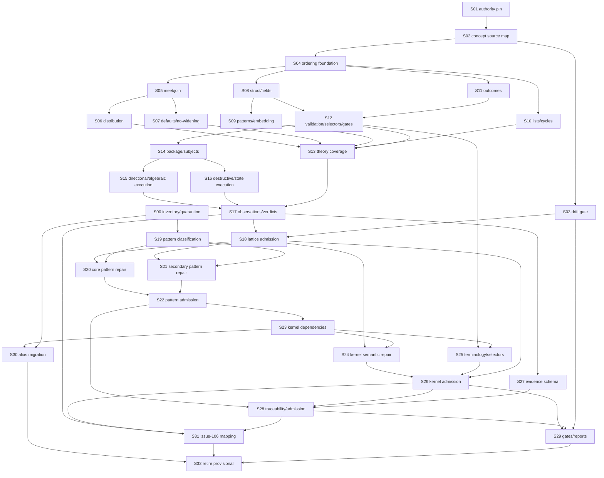

<!-- issue-107-implementation-slices:v1 -->

# Candidate implementation slices

## Status and use

This comment is a **non-authoritative implementation-planning projection** derived from the canonical requirement graph in #107. It does not amend the issue body, change requirement dependencies, or admit any implementation.

Each child implementation issue must still:

- identify its directly satisfied requirement and acceptance IDs;
- enumerate the complete transitive local dependency closure from #107;
- bind the exact #107 revision and normalized requirement snapshot;
- declare a validation DAG that refines that closure;
- map every selected acceptance criterion to applicable scenarios;
- identify concrete artifacts, commands, fixtures, subjects, observations, evaluations, and evidence;
- obtain CUE-computed admission rather than claiming completion.

The IDs below are the **direct satisfaction set** proposed for each slice, not an abbreviated dependency closure.

## Slicing constraints

1. Keep one semantic boundary or authority transition per slice.
2. Prefer two to four directly satisfied requirements; single-requirement slices are appropriate for admission, drift, or migration boundaries.
3. Do not combine application-pattern repair with kernel repair.
4. Do not implement runner transport, subject derivation, or raw-observation semantics outside the #106 compatibility boundary.
5. A slice may produce provisional artifacts, but no downstream slice may consume them as admitted authority.
6. Cross-repository `fatb4f/lattice` changes require their own issue/branch/PR while retaining #107 requirement traceability.

---

## Slice map

| Slice | Direct requirements | Purpose | Primary output / exit condition |
|---|---|---|---|
| **S00 — Current-surface inventory and quarantine** | `PT-01`, `KR-01`, `MG-01` | Inventory the existing 16-pattern catalog and kernel surface, then mark every unadmitted semantic claim explicitly provisional. | Revision-bound inventories plus a fail-closed status projection proving current patterns/kernel cannot satisfy downstream admission or no-widening dependencies. |
| **S01 — Upstream authority boundary** | `UA-01`, `UA-02` | Define source classes and pin the exact upstream CUE revision and artifacts. | Closed upstream-authority record with repository, commit, paths, digests, CUE/Go module identities, and negative fixtures for mutable or mismatched sources. |
| **S02 — Upstream concept source map** | `UA-03`, `UA-04` | Map lattice claims to exact upstream specification sections, API symbols, tests, and explanatory sources; normalize stable concept IDs. | Machine-readable source inventory and domain-neutral lattice concept catalog. |
| **S03 — Upstream drift gate** | `UA-05` | Invalidate stale authority and prior admissions when pinned upstream evidence changes. | Drift comparison, affected-concept projection, and fail-closed re-evaluation trigger. |
| **S04 — Ordering, top/bottom, and atoms** | `LT-01`, `LT-02`, `LT-03` | Establish the foundational value-ordering vocabulary before algebraic laws are implemented. | Closed contracts and fixtures for directional subsumption, top, bottom, atoms, basic types, numeric ordering, and concreteness. |
| **S05 — Meet and join laws** | `LT-04`, `LT-05` | Implement executable unification/meet and disjunction/join law families. | Positive, negative, invariant, and adversarial fixtures for commutativity, associativity, idempotence, identities, annihilators/dominators, monotonicity, and join normalization. |
| **S06 — Distribution** | `LT-06` | Prove the admitted distribution relation over the supported plain-value subject class. | Directionally sourced equivalence fixtures, explicit excluded forms, and semantic value comparisons. |
| **S07 — Defaults and directional no-widening** | `LT-07`, `LT-08` | Model marked-disjunction/default-pair behavior and define no-widening as directional subsumption. | Default-selection fixtures and a runner-facing no-widening operation that cannot be replaced by exact-key compatibility or `A & B`. |
| **S08 — Struct closure and field ordering** | `ST-01`, `ST-02`, `ST-03` | Establish open/closed struct ordering, definition closure, explicit `close`, and regular/required/optional field relations. | Structural fixture families separating recursive definition closure, explicit closure, field presence modes, and directional ordering. |
| **S09 — Pattern constraints and embedding** | `ST-04`, `ST-05` | Cover label constraints, ellipsis, typed ellipsis, unmatched fields, and embedding interaction with closure. | Focused positive/negative fixtures proving structural admission and rejection without conflating embedding with ordinary fields. |
| **S10 — List ordering and cycle classes** | `ST-06`, `ST-07` | Complete the remaining structural theory families. | Ordered list-subsumption/cardinality fixtures and classified benign, recursive, fixed-point, incomplete, arithmetic, and structural cycle fixtures. |
| **S11 — Semantic outcome taxonomy** | `ES-01`, `ES-02` | Define typed outcomes and expected-bottom inversion before higher-level fixture execution. | Closed outcome and negative-fixture schemas distinguishing accept, bottom, incomplete, structural failure, and infrastructure failure. |
| **S12 — Validation, finality, selectors, and CLI boundaries** | `ES-03`, `ES-04`, `ES-05` | Separate validation/concreteness/finality/exportability, classify selector outcomes, and bound structural CLI evidence. | API/CLI-mode matrix, selector fixtures, and explicit structural-gate observations that cannot establish semantic subsumption or bottom. |
| **S13 — Theory coverage manifest** | `LT-09` | Aggregate the admitted primitive, law, structural, and evaluation-state families into one coverage contract. | Closed manifest of covered, deferred, excluded, and application-only concepts with source and fixture bindings. |
| **S14 — Conformance package and effective subjects** | `CF-01`, `CF-02` | Create the closed lattice-conformance package and canonical effective semantic-subject model. | Versioned CUE package plus subject derivation/validation fixtures rejecting caller-overridden source or engine identity. |
| **S15 — Directional and algebraic execution** | `CF-03`, `CF-04` | Execute directional subsumption and algebraic-law probes through the admitted #106 operation boundary. | Fact-only observations for both subsumption directions and semantic equality/equivalence checks over canonical subjects. |
| **S16 — Destructive and evaluation-state execution** | `CF-05`, `CF-06` | Execute expected-bottom and incomplete/concrete/final/exportability probes without collapsing outcome classes. | Independently valid conflict operands, selected destructive proof paths, one-defect ingress fixtures, and typed state observations. |
| **S17 — Observation normalization and CUE verdicts** | `CF-07`, `CF-08` | Normalize facts from the runner and derive all verdict/coverage aggregation in CUE. | Closed observation ingress, rejection of verdict-bearing runner output, and CUE-computed probe/family/concept/candidate/suite states. |
| **S18 — Lattice suite admission** | `CF-09` | Admit the complete upstream lattice-conformance suite. | Literal CUE-exported `true` only when pinned authority, all P0 concept families, structural gates, scenarios, and evidence are complete. |
| **S19 — Pattern classification** | `PT-02` | Classify every catalog entry independently across source validity, semantic fidelity, and proof-capability fidelity. | Versioned classification report with admitted repair target or explicit deferral for each of the 16 patterns; `schema.cue` remains metadata. |
| **S20 — Core semantic pattern repairs** | `PT-03`, `PT-04`, `PT-05` | Repair the patterns that currently misstate subsumption, bottom, negative-fixture execution, projection preservation, or no-widening. | Correctly named compatibility/subsumption surfaces, actual selected conflicts, runner-inverted negative fixtures, and separated projection construction/relation checks. |
| **S21 — Secondary pattern repairs** | `PT-06` | Repair defaults, create proofs, definition examples, and cycle examples. | Nondegenerate defaults, complete create-edge proofs, definition-closure examples, and cycle fixtures tied to admitted upstream classes. |
| **S22 — Pattern authority consumption and admission** | `PT-07`, `PT-08` | Make application patterns consume the lower lattice authority and publish the admitted catalog manifest. | No theory redefinition in application patterns; versioned manifest binds dependencies, fixtures, assertion modes, status, deprecations, and evidence. |
| **S23 — Kernel dependency and compatibility surface** | `KR-02`, `KR-03` | Bind kernel declarations to admitted pattern/theory dependencies and separate exact-key compatibility from stronger semantic claims. | Kernel dependency manifest and explicitly bounded compatibility proof names with no misleading no-widening alias. |
| **S24 — Kernel directional and destructive repairs** | `KR-04`, `KR-05` | Implement true runner-backed no-widening and executable destructive/invalid-ingress fixture families. | Directional observations for widened/add/remove/reference cases; destructive conflicts use valid closed operands; ingress fixtures contain one targeted mutation. |
| **S25 — Kernel terminology and selector boundary** | `KR-06` | Correct closure naming and document any selector grammar as a bounded local subset. | Migration/deprecation map for old names and explicit distinction between local ASCII dotted selectors and upstream CUE selector syntax. |
| **S26 — Kernel admission** | `KR-07` | Admit the kernel only after all theory, pattern, semantic, structural, and evidence dependencies pass. | Literal CUE-exported kernel admission `true`; source-level compatibility remains a non-admitting report field. |
| **S27 — Revision-bound evidence schema** | `EV-01` | Replace string evidence labels with closed, revision-bound evidence records. | Evidence schema binding requirement, acceptance, scenario, source, artifact, selector, operation, subject, observation, evaluation, engine, and digests. |
| **S28 — Traceability and computed admission** | `EV-02`, `EV-03` | Bind every acceptance criterion to scenarios/evidence and compute closure, workflow, pattern, kernel, and final admission in CUE. | Negative fixtures reject missing closure, foreign evidence, uncovered criteria, and claimant-supplied validity fields. |
| **S29 — Structural gates and bounded reports** | `EV-04`, `EV-05` | Execute declared structural package gates and publish non-authoritative alignment/drift projections. | Explicit module/package/file gate observations and bounded reports for admitted, provisional, failed, deferred, or drifted status. |
| **S30 — Compatibility alias migration** | `MG-02` | Preserve legacy identifiers only through explicit replacement records. | Alias map with replacement target, semantic delta, deprecation state, compatibility fixtures, and removal condition. |
| **S31 — Issue-106 compatibility integration** | `MG-03` | Connect #107 contracts to the admitted #106 runner/interface without duplicating protocol ownership. | Versioned compatibility mapping for operations, subjects, observations, selectors, engine identities, and artifact handoff. |
| **S32 — Guidance update and provisional retirement** | `MG-04` | Update procedural surfaces and retire provisional status after computed admission. | `SKILL.md` and manifests reference admitted commands/contracts, distinguish non-concrete and concrete gates, and expose no premature completion claim. |

---

## Recommended execution lanes



This lane graph is a planning projection. The direct `depends_on` records in #107 remain canonical if this projection omits or overstates an edge.

## Suggested first implementation tranche

The smallest useful initial tranche is:

```text
S00  current-surface inventory and quarantine
S01  upstream authority boundary
S02  upstream concept source map
S04  ordering/top-bottom/atoms
S11  semantic outcome taxonomy
S14  conformance package and effective subjects
```

That tranche does **not** admit lattice theory, patterns, or the kernel. It establishes the vocabulary and identities required to implement later semantic probes without preserving the current unification-as-subsumption or declaration-as-expected-bottom errors.

## Child-issue naming convention

```text
#107 Slice SNN: <bounded implementation objective>
```

Each child issue should include a stable marker:

```html
<!-- issue-107-slice:SNN:v1 -->
```

and record:

```text
directly satisfied IDs
acceptance IDs
complete transitive closure
pinned #107 transport and normalized snapshot
artifact boundary
scenario manifest
validation DAG
evidence manifest
admission command
non-goals
```
